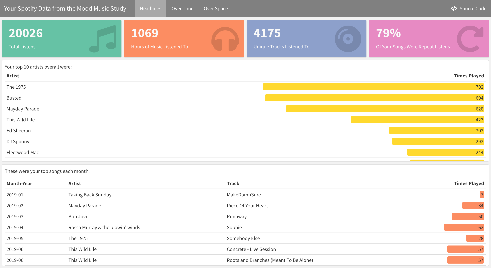
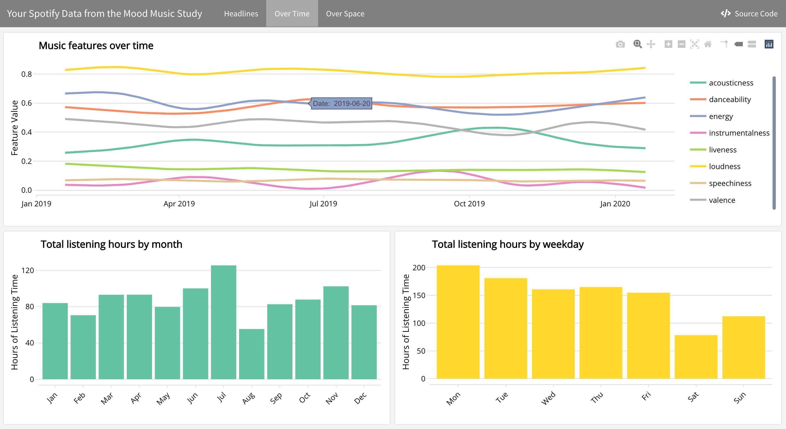
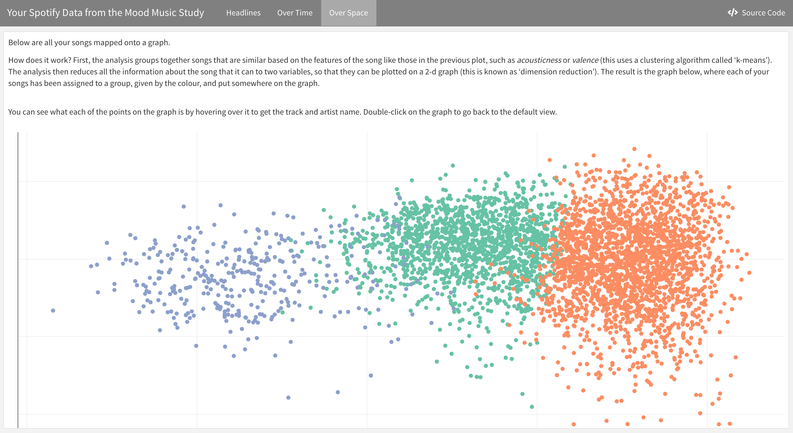

# Spotify Dashboard

The `.Rmd` file will generate a `.html` multi-page dashboard describing an individual's Spotify data. It is built using R Markdown, [Plotly](https://plotly.com/) and [flexdashboard](https://rmarkdown.rstudio.com/flexdashboard/index.html). 

This dashboard will accept a `.csv` where each row contains a listening event in an individuals Spotify listening history. 
It is designed to work with the data exported from the [Spotify Rehydrator](https://github.com/DynamicGenetics/Spotify-Rehydrator).

## Graphs and Summaries included  
* Number of listening events in the data  
* Number of hours of music played overall  
* The percentage of songs that were repeated  
* The number of unique tracks listened to  
* Top 10 artists listened to  
* Top song for each month of data  
* A time-series plot of eight of the music features over time  
* Bar chart of the number of hours of music listened to each weekday
* Bar chart of the number of hours of music listened to each month  
* A plot of all the songs as points, with the x and y axes as principle components, and songs coloured by their k-means cluster  

## Example
The below are examples of each page of the dashboard. 

